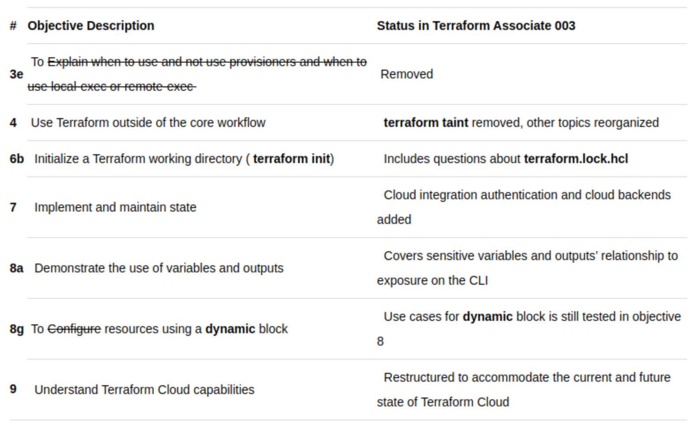

HashiCorp has introduced the new Terraform Associate 003 Certification exam to replace the previous version 002.
The 003 exam aligns better with the evolving features of HashiCorp Terraform and its growth. The exam's structure has been updated to match the product's current state, and more information about the changes and how to sign up can be found on the new certification page.

# Differences between Terraform Associate 003 and 002:

## Removed Objectives:

-  No provisioners allowed: Remote-exec, Local-exec. Terraform provides built-in functionalities as replacements.
-  "terraform taint" command deprecated, replaced with "terraform [plan | apply] -replace".
-  "terraform refresh" command deprecated, replaced with "terraform [plan | apply] -refresh-only".
-  "terraform workspace" command removed from the exam (not deprecated).
-  The dynamic block for configuring resources is still relevant, but it's not a separate sub-objective.

## Added Objectives:

-  Introduction of the "cloud" block connecting configurations to Terraform Cloud as a remote State backend.
-  Describe different remote state storage mechanisms and supported standard backends.
-  Manage Terraform drift and state.
-  Introduction of "terraform.lock.hcl" files generated during "terraform init" to record provider and module version constraints for consistency and locking into specific versions.
-  Demonstrate use of variables and outputs: sensitive values are now part of this objective.
-  Grouping of three sub-objectives into two:
-  Explain how Terraform Cloud manages infrastructure and workspaces.
-  Describe Terraform Cloud governance, cost controls, collaboration, and the private registry.

## Recommendations:

- Sign up for a Terraform Cloud account and utilize the free trial to explore all features for 30 days.
- Focus on understanding new functionality and features introduced in version 003.
- Pay attention to the "cloud" block, "terraform.lock.hcl" files, using "-refresh-only" and "-replace" with plan and apply, and marking variables/outputs as sensitive.

Here is a list of more noteworthy changes : 

Difference between Terraform Associate Certification 002 and the version 003

- Please note that it's always a good idea to cross-reference with official documentation and resources to ensure accuracy.